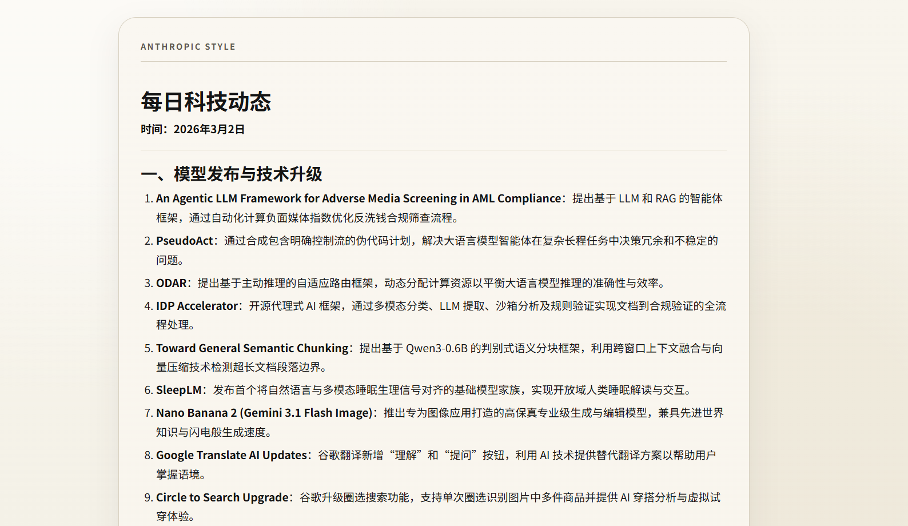

# InfoStream

[English](README_EN.md) | 简体中文

InfoStream 是一个可扩展的信息源采集与每日摘要流水线。它从多个来源抓取更新，统一结构、去重并沉淀可追溯产物，最终输出人读和机读两种摘要结果。

## 在线预览

- https://zysbz.github.io/InfoStream/

## 界面预览



## Overview

InfoStream 面向可重复执行的日常信息流工作：

- 通过插件注册表接入异构信息源。
- 统一为共享的 item 合同结构。
- 落盘原始证据与运行元数据，支持追溯审计。
- 使用 SQLite 做去重与版本管理。
- 通过 AI 生成摘要，并在失败时回退到确定性摘要。

## Features

- 已实现插件：
  - `github_trending`
  - `github_search`
  - `rss_atom`
- `bilibili_up` 已有脚手架，但在 MVP 阶段默认禁用。
- SQLite 目录库用于去重与版本化（`data/catalog.db`）。
- 每次运行生成独立归档目录（`output/YYYYMMDD_HHMM/`）。
- 摘要产物：
  - `digest.md`（人读）
  - `digest.json`（机读）
  - `summary.md`（对 digest 的二次精简摘要）
  - `output/latest.html`（固定复用网页，每次运行覆盖更新）
- DashScope 兼容 LLM 客户端（默认模型 `deepseek-v3.2`）。
- 运行期保护机制：
  - 同日 URL 复用
  - 同日缓存回填
  - GitHub `403` 限流后的来源组冷却

## 快速开始（从安装 `uv` 到首次跑通）

### 1）安装 `uv`

macOS / Linux：

```bash
curl -LsSf https://astral.sh/uv/install.sh | sh
```

Windows PowerShell：

```powershell
powershell -ExecutionPolicy ByPass -c "irm https://astral.sh/uv/install.ps1 | iex"
```

安装完成后验证：

```bash
uv --version
python --version
```

### 2）获取项目代码

```bash
git clone <你的仓库地址> InfoStream
cd InfoStream
```

如果你已经有本地代码，直接 `cd` 进入目录即可。

### 3）配置环境变量

先复制模板文件：

macOS / Linux：

```bash
cp .env.example .env
```

Windows PowerShell：

```powershell
Copy-Item .env.example .env
```

然后编辑 `.env`：

```env
DASHSCOPE_API_KEY=your_dashscope_api_key
GITHUB_TOKEN=optional_github_token
```

- `DASHSCOPE_API_KEY`：用于启用 LLM 摘要；未配置时会回退为确定性摘要。
- `GITHUB_TOKEN`：可选，用于提高 GitHub API 配额。

### 4）安装依赖

```bash
uv sync
```

可选（开发/测试依赖）：

```bash
uv sync --extra dev
```

### 5）先做配置校验

```bash
uv run main.py validate-config --sources configs/sources.yaml --run-config configs/run_config.json
```

### 6）运行一次流水线

```bash
uv run main.py run --sources configs/sources.yaml --run-config configs/run_config.json --timeouts configs/timeouts.yaml --output-root output --data-root data
```

### 7）查看结果

- 每次运行归档目录：`output/YYYYMMDD_HHMM/`
- 关键产物：
  - `digest.md`
  - `digest.json`
  - `summary.md`
- 固定复用网页：
  - `output/latest.html`

## Configuration

核心配置文件：

- `configs/sources.yaml`
  - 来源列表（`name`、`type`、`enabled`、`entry_urls`、`params` 等）
  - 转写策略
  - GitHub 搜索关键词
- `configs/run_config.json`
  - 运行策略（`max_items`、`llm_model`、`source_limits`、`source_name_limits`、`source_url_limits`、`timezone`、复用/回填开关、摘要偏好）
  - 摘要偏好重点字段：`digest_include_statuses`、`digest_fallback_statuses`、`digest_section_quota`、`freshness_window_hours`、`show_reused_section`
  - `llm_model` 可选模型字段，默认 `deepseek-v3.2`（示例：`qwen3.5-397b-a17b`）
  - `max_items` 范围：`1-200`（模型默认 `10`）
- `configs/timeouts.yaml`
  - 请求、来源、全局运行超时

来源配额与覆盖说明（`run_config.json`）：

- `source_limits`
  - 按来源组限额（如 `github`、`rss_atom`）。
- `source_name_limits`
  - 按来源名限额（例如 `github_search_ai`、`rss_ai_feeds`），用于防止单一来源吃满候选池。
  - 键名大小写不敏感，内部统一转为小写。
  - 示例：
    - `"source_name_limits": {"github_search_ai": 8, "rss_ai_feeds": 12}`
- `source_url_limits`（必填，按 entry_url 单独配额）
  - 每个启用来源的每个 `entry_url` 都必须配置额度；缺失会在 `validate-config` 和 `run` 阶段直接报错。
  - 这是你要求的“同组内 URL 也要单独限额”。例如 `rss_ai_feeds` 下的 `huggingface` 与 `deepmind` 需分别配置。
  - 示例：
    - `"source_url_limits": {"https://huggingface.co/blog/feed.xml": 6, "https://www.deepmind.com/blog/rss.xml": 4}`
- 与 `github_trending_total_limit` 的关系
  - 对 `github_trending_*` 来源会自动分配来源名限额。
  - 若同一来源同时命中 `source_name_limits` 和自动分配限额，取更严格（更小）的值。
- 是否保证“每个来源都一定有结果”
  - 不保证。来源可能因无新条目、超时、限流冷却、抓取失败而产出 0。
  - 但系统会按配置顺序尝试所有可用来源，并在候选计数中记录每个来源实际贡献。
- RSS 新旧顺序
  - `rss_atom` 在 discover 阶段会按发布时间降序排序，优先处理最新条目（不再依赖 feed 原始返回顺序）。

摘要偏好参数说明（`run_config.json`）：

- `digest_include_statuses`
  - 主选池状态列表，优先从这些状态里选摘要条目。
  - 常见值：`new`（新增）、`updated`（更新）。
- `digest_fallback_statuses`
  - 回补状态列表；当主选池不足时，按该列表回补。
  - 常见值：`reused`（复用）、`unchanged`（未变化）。
  - 注意：不能与 `digest_include_statuses` 重叠。
  - 可设为空数组 `[]`（表示不做回补，仅依赖主选池与陈旧候选补位）。
- `digest_section_quota`
  - 各分区目标配比（不是硬上限），最终会按 `max_items` 计算到各分区目标数。
  - 例如 `{"new": 50, "updated": 30, "reused": 20}`，当 `max_items=30` 时目标约为 `15/9/6`。

示例（平衡“新内容优先 + 不足回补”）：

```json
{
  "max_items": 30,
  "digest_include_statuses": ["new", "updated"],
  "digest_fallback_statuses": ["reused", "unchanged"],
  "digest_section_quota": {
    "new": 50,
    "updated": 30,
    "reused": 20
  }
}
```

状态判别标准（用于 `digest_include_statuses` / `digest_fallback_statuses`）：

- `new`
  - 条件：`item_id` 首次出现（`items` 表中不存在该 id）。
  - 结果：写入首个版本（`v1`）。
- `updated`
  - 条件：`item_id` 已存在，但与最新版本相比，`text_hash` 或 `meta_hash` 至少一个发生变化。
  - 结果：版本号递增（如 `v2`、`v3`）。
- `unchanged`
  - 条件：`item_id` 已存在，且 `text_hash` 与 `meta_hash` 都未变化。
  - 结果：复用当前最新版本号，不新增版本。
- `reused`
  - 条件：命中同日缓存（按归一化 URL 或同日来源缓存）直接复用历史条目，不重新抓取。
  - 结果：进入复用路径，摘要分区归类为 `reused`。

补充说明：

- `item_id` 由各插件的 `fingerprint` 规则生成（不是 URL 直接等值判断）。
- 摘要层将 `unchanged` 与 `reused` 都归入 `reused` 分区展示。
- 若条目从未进入过任何历史 `digest`，即使本次命中 `reused/unchanged`，摘要选择阶段也会提升其优先级（避免因中断运行导致有价值条目长期被压低）。

常用运行时覆盖：

```powershell
uv run main.py run --max-items 20
uv run main.py run --add-url https://github.com/trending
uv run main.py run --no-progress
```

## CLI Usage

列出插件：

```powershell
uv run main.py list-plugins
```

校验配置：

```powershell
uv run main.py validate-config --sources configs/sources.yaml --run-config configs/run_config.json
```

执行流水线：

```powershell
uv run main.py run --sources configs/sources.yaml --run-config configs/run_config.json --timeouts configs/timeouts.yaml
```

## Output Layout

每次运行输出目录：

```text
output/YYYYMMDD_HHMM/
  digest.md
  digest.json
  summary.md
  items/
  raw/
  logs/
    run.log
    errors.json
  run_meta.json

output/
  latest.html
```

单条 item 目录：

```text
items/<source>__<title_sanitized>__<shortid>/
  content.txt
  meta.json
  evidence.json
  raw/
```

## Testing

```powershell
uv run pytest -q --basetemp=./tmp_pytest
```

## GitHub Actions + Pages（每日自动更新）

仓库已支持通过 GitHub Actions 每日自动执行 `uv run main.py run`，并将 `output/latest.html` 部署为 GitHub Pages 静态页。

一次性设置：

1. 确保仓库包含工作流文件：`.github/workflows/daily-pages.yml`。
2. 在 GitHub 仓库设置中打开 `Settings -> Pages`，`Build and deployment` 的 `Source` 选择 `GitHub Actions`。
3. 可选：在 `Settings -> Secrets and variables -> Actions` 新增 `DASHSCOPE_API_KEY`（用于 LLM 摘要；未配置时会自动回退到确定性摘要）。

说明：

- 工作流支持手动触发（`workflow_dispatch`）和每日定时触发。
- 当前 cron 是 `0 0 * * *`（UTC 每天 00:00，对应北京时间每天 08:00）；如果你希望按其他本地时区运行，可直接修改该字段。
- GitHub Actions 定时任务可能有几分钟到十几分钟延迟，实际开始时间不一定严格等于 `08:00`。
- 部署时会把 `output/latest.html` 同步为 Pages 的 `index.html`（同时保留 `latest.html`）。

## Privacy and Security

- 不要提交 `.env` 或真实密钥。
- API Key 仅通过环境变量注入。
- `output/` 与 `data/` 属于本地产物，不应进入版本库。
- 每次推送前检查暂存区：

```powershell
git status --short
git diff --cached --name-only
```

## Roadmap

- 完成可生产使用的 `bilibili_up` 插件。
- 扩展与 C++ 采集核心的 NDJSON 互操作。
- 增加更多来源模板与策略控制能力。

另见：

- `docs/architecture.md`
- `docs/cpp_ndjson_contract.md`

## License

本项目基于 MIT License 发布，详见 [LICENSE](LICENSE)。
